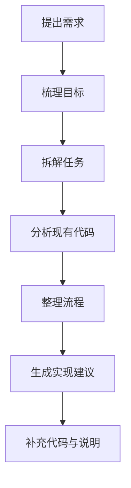

#  2026国内最新 ChatGPT Plus 代充教程，微信支付，正规渠道，附全自助在线充值教程

这两年，很多人第一次接触 ChatGPT，都是从“随便问问”开始的。  
问几个问题，翻译两段话，润色一段内容，感觉已经挺方便了。

所以一开始，不少人对 ChatGPT Plus 都是观望态度。  
不是不知道它有订阅版，而是总觉得：先用免费版也行，没必要着急升级。

但真正连续用一段时间之后，感受会慢慢变。  
尤其是当你不再只是偶尔问一句，而是开始把它放进日常工作里，你会发现免费版和长期生产力工具之间，还是有明显区别的。

这篇文章不打算写成那种生硬的功能罗列，也不想讲得太官方,我更想从实际使用的角度，聊聊 ChatGPT Plus 到底值不值得开，以及为什么最近越来越多人开始认真用它。尤其是写代码，之前都是复制代码过去问，现在推出的codex能直接读工作区间代码，给个目录就能阅读能修改你的代码能给出建议，这比要复制很多上下文去gpt网页端流畅多啦。

## ChatGPT Plus 是什么，多少钱

现在代充市面上有低于远20刀以下的0元购，是刷的优惠卷几乎没有成本的充值方式，这种一般价格很低，正常的代充价格在160-180之间算正常，因为一般网站有运营成本，有客服成本，太低就要注意小心是0元购，这种方式后期可能被清算封号。

本人推荐的代充都是正规的官方直充，在我这里充值的要不在网页直接购买，要不直接加我微信我帮你充值，因为微信没有运营成本能比网站便宜点，如果不介意可以直接加微信号：lchhlp咨询。或者直接访问下发网站地址全自助充值。

> ChatGPT代充：[https://chongzhi.aliyuncn.com](https://chongzhi.aliyuncn.com/)

说一下微信找我我充值的步骤：

>1. 电脑浏览器登录你自己的chatgpt账号
>2. 然后浏览器再新打开个网页输入如下地址：[https://chatgpt.com/api/auth/session](https://chatgpt.com/api/auth/session)
>3. 然后把网页返回的文本全部复制发送给我，我就能帮你充值。 

ChatGPT Plus 它本质上是 ChatGPT 的个人订阅服务，不是一次性买断，也不是 API 套餐。顺便说一句codex不需要单独再充值，充值完plus就能直接登录使用。

这个地方很多人一开始容易搞混,简单说就是：

**ChatGPT Plus**：主要是你在网页端或客户端里使用 ChatGPT 的订阅服务。

**API**：主要给开发者接入程序、做自动化调用，两者是分开的。

所以如果你开了 Plus，并不代表你同时拥有 API 额度，反过来也是一样，有 API 也不等于你自动拥有 ChatGPT Plus 的网页订阅体验。

如果你平时主要是自己写内容、看文档、做分析、改代码、辅助办公，那你更关心的通常升级GPTPlus就行。

## 为什么还有这么多人愿意升级 Plus

如果只是偶尔打开一次，问几个轻量问题，免费版已经能覆盖很多场景。  
但如果你开始高频使用，差别就会慢慢出现，因为这时候你要的已经不是“能不能回答”，而是：

- 稳不稳定
- 顺不顺手
- 能不能持续接住上下文
- 能不能帮你把一件事一路往下推进

真正开始把 ChatGPT 当工具的人，关注点往往不再是“这个功能听起来厉不厉害”，而是“它到底能不能让我少折腾一点”。 从这个角度看，Plus 的价值就比较容易理解了。

## 哪些人更适合认真考虑 ChatGPT Plus

不是所有人都需要第一时间升级。但下面这几类人，通常更容易真正用出它的价值。我觉得就是你用plus创造的价值远高于20刀，那么你无脑升级。

### 1. 经常写内容的人

包括但不限于： 写博客，写方案 写文案 写邮件 写脚本 写推广页 写说明文档等字媒体。

这类人最常遇到的问题，不是完全没东西写，而是脑子里有一堆内容，落地速度太慢。要么卡在开头，要么中间写散了，要么写完了又觉得结构不顺。

这时候，ChatGPT Plus 更像是一个写作辅助工具。它不只是帮你“生成一段话”，而是能配合你把提纲、正文、改写、补充说明这一整套流程往前推。

### 2. 开发者、测试、产品、技术支持

这一类用户的感受通常会更直接。，因为技术相关的工作，最怕的不是没有答案，而是答案太零碎。  
尤其是下面这些场景：

- 接手旧项目，看历史代码：看不懂别人的代码和项目那么让codex给你阅读真的事半功倍。
- 理解复杂逻辑 根据需求补充实现逻辑，给出上下文补充完整代码。这是gptplus5.4的强项。

如果只是问一句“这段代码是什么意思”，那很多工具都能凑合用，但如果你是要把一个问题从理解到落地一路推进，模型是否能持续跟着你走，差距会非常明显。

### 3. 经常读文档、看表格、整理资料的人

很多人低估了这一类需求，现实工作中，其实有大量时间不是花在“创作”，而是花在“消化信息”上。

看一份需求说明 理一张复杂表格 总结一段会议记录 从一堆聊天记录里提炼重点 看接口文档后拆出任务列表 对比几种方案的差异等。

这种工作不难，但特别消耗脑力。  
而一个能先帮你梳理结构、提炼重点、指出问题的工具，往往能让后面的事情轻很多。

## 建议ChatGPT Plus 配合 Codex 一起用

这是最近比较明显的一个变化。，以前很多人会把“聊天”和“写代码”分成两个完全不同的世界。  
在聊天窗口里问思路，在 IDE 里自己写代码，卡住了再回来问，问完再切回去继续改。

这种方式不是不能用，但很碎。来回切换多了，最耗的其实不是写本身，而是不断重新进入状态。

而最近，GPT-5.4 已经可以直接在 Codex 上使用了。  
对开发者或者经常和代码打交道的人来说，这件事带来的价值不是一句“功能升级”能概括的，而是整套流程会更顺。直接下载codex客户端，然后登录你的chatgpt账号密码就行，plus通用。

你可以先让它帮你理解需求，再帮你拆逻辑、理代码、整理流程，接着继续往下补实现，整个过程更像是在同一个上下文里持续协作，而不是每走一步都得重新讲一遍背景。

比如我让codex给我拆解的代码逻辑，流程图配合说明一目了然。

## GPT-5.4 配合 Codex，实际能帮你做什么

这里不讲太空泛的概念，直接说更接近真实使用的场景。基本都是我日常开发会用到的。

### 1. 拆代码，比以前更像“带着你看”

有些代码不是看不懂，而是懒得从头理，特别是历史项目、遗留逻辑、复杂 SQL、层层调用的方法链，一眼看过去就让人头大。

这时候，如果只是简单问一句“这段代码是干嘛的”，帮助通常有限，更有用的是，它能先把结构拆开，再一层层往下讲：

- 这个类的职责是什么
- 哪个方法是入口
- 核心链路怎么走
- 哪些地方只是辅助逻辑
- 哪些字段是关键输入输出
- 哪些位置最容易出问题
- 如果要改，先动哪一层更稳

这种能力最大的价值，不在于它替你看代码，而在于它先帮你画出一张理解地图。

### 2. 可以先帮你整理流程图思路

很多复杂问题，难点不在“有没有答案”，而在“脑子里太乱”。 比如：

- 登录鉴权流程
- 支付回调流程
- 消息消费与失败重试
- 前后端调用时序
- 微服务之间的责任边界

这些东西如果只靠脑子硬记，很容易越想越乱，这时候我比较常用的一种方式，就是先让它整理成流程草稿，再自己继续微调，如果需要，也可以直接让它先输出 Mermaid。

这种方式的重点，不是图画得多漂亮，而是它能先帮你把思路顺清楚，然后配合代码自己看就能明白代码为什么这样写。

### 3. 补代码，不只是补一段，而是补整条链路

很多人对 AI 写代码的理解，还停留在“自动补全几行”。，但真正常用之后会发现，更有价值的地方，往往不是那一小段代码本身，而是它知道这段代码前后还应该补什么。

比如你让它补一个接口逻辑，它不只是给你一个 controller 方法，还可能顺着把这些内容一起理出来：

- DTO
- VO
- service 方法
- 参数校验
- 异常处理
- 返回结构
- 注释说明
- 命名优化建议

这种体验更接近“协助你把事情做完整”，而不是“给你一小段代码，剩下你自己拼”。

### 4. 读文档、拆需求、整理资料

这其实是非常适合高频使用的一类场景，你把需求文档、接口说明、表结构、历史聊天记录、截图材料丢进去，让它先帮你：

- 总结关键点
- 提炼问题
- 列出任务项
- 拆成执行步骤
- 整理成更清晰的结构

这件事本身看起来不炫技，但非常实用，因为很多工作真正耗时间的地方，不是不会做，而是前面的理解和整理太费精力。

## 那 ChatGPT Plus 到底值不值得开

我自己的判断标准其实很简单，如果你只是偶尔体验一下，想到什么问什么，一个月打开没几次，那免费版完全可以先用着。  
但如果你已经开始出现下面这些使用习惯了，那 Plus 大概率是值的：

- 经常让它写长内容
- 经常多轮改稿
- 经常上传文件让它分析
- 经常让它拆代码、理逻辑、看报错
- 经常让它从一个模糊想法一路推进到成稿、方案或实现

因为一旦进入这种使用方式，你需要的就不再只是“它会不会答”，而是：

- 能不能稳定一点
- 能不能顺一点
- 能不能减少来回折腾
- 能不能把你的时间省下来

从这个角度看，Plus 的价值其实很现实。而且用久了基本上会依赖 Plus，还是那句话plus工具用的好肯定物有所值，一天才几块钱算下来。
你买的不是一句回答，而是一整段连续协作过程里的效率提升。

## 如果你本来就在写代码，更没必要只把它当成聊天框

这一点是我最近感受很深的。 很多人虽然已经在用 AI，但还是把它停留在“问答工具”的阶段。  
问一个问题，拿一个答案，复制一下，然后结束。

这种用法当然没错，但说实话，有点可惜。因为现在更好的使用方式，应该是让它贯穿整条链路：

- 先帮你理解需求
- 再帮你拆任务
- 然后分析现有代码
- 接着整理实现思路
- 最后补代码、补注释、补说明

尤其是最近 GPT-5.4 在 Codex 上可以直接使用之后，这种感觉会更明显。你会发现它不只是适合回答，而是适合参与。

说白了就是别把gpt当搜索引擎，要当一个帮助你的实习生，你给下达明确的任务，他帮你完成任务。AI缺少的是创造力，人掌握主动工具提高效率。

## 常见问题

### ChatGPT Plus 和 API 是一回事吗？

不是。Plus 是 ChatGPT 的订阅服务，API 是开发接口，两者用途和计费方式都不同。

### ChatGPT Plus 现在多少钱？

详情见代充充：代充详情：[https://chongzhi.aliyuncn.com](https://chongzhi.aliyuncn.com/)

### GPT-5.4 现在能直接在 Codex 上用吗？

可以。直接登录，网页版和codex一个账号通用plus，而且现在拿它来做代码拆解、逻辑整理、流程梳理，整体体验确实会比以前更顺。

### GPT-5.4 更适合做什么？

比较适合复杂推理、代码相关工作、文档处理、资料整理以及多步骤任务这类场景。

### Codex 适合哪些人？

如果你平时会写代码、改代码、看项目、拆需求、读文档，那 Codex 的价值会比较明显。  
尤其是现在搭配 GPT-5.4，一整套流程会更顺。

## 完整版自助充值教程

如果你超级懒不想看文档先看这个简单指引操作不行再看文档教程：

**输入卡密》立即校验》前往登录账号》获取文本密钥》全选复制密钥》填入密钥》校验 token》充值成功**

1.点开充值网站，[chatgpt代充](https://chongzhi.aliyuncn.com/)

2.输入卡密，点击立即体验

3.登录你自己的 gpt 账号，获取 json 文本

4.点击获取，充值密钥

5.复制全部文本到文本框

6.校验 token

7.立即充值，等页面刷新弹出充值成功

8.充值成功

9.备注
万一充值失败或者有问题联系客服微信：lchhlp 处理，一定帮你搞定，搞不定全额退款，不要点投诉。